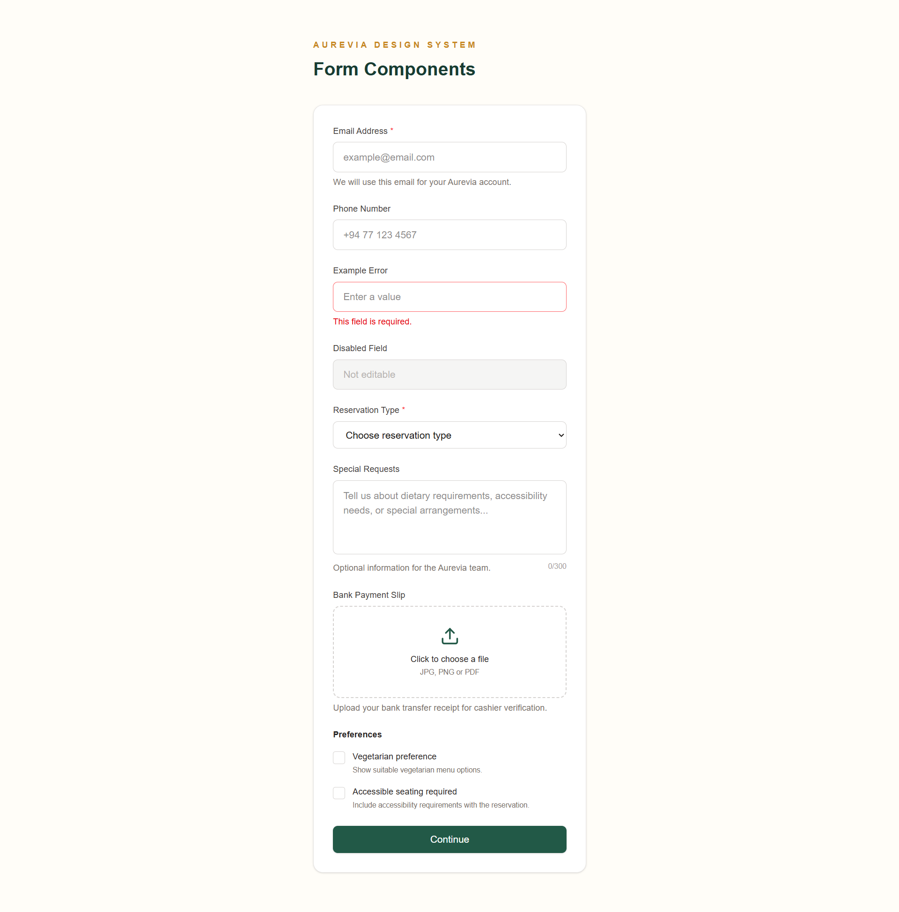
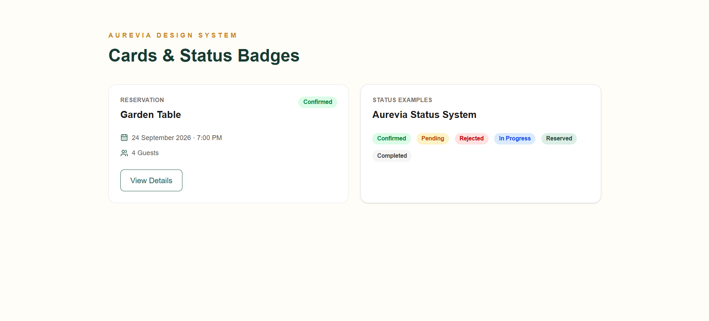
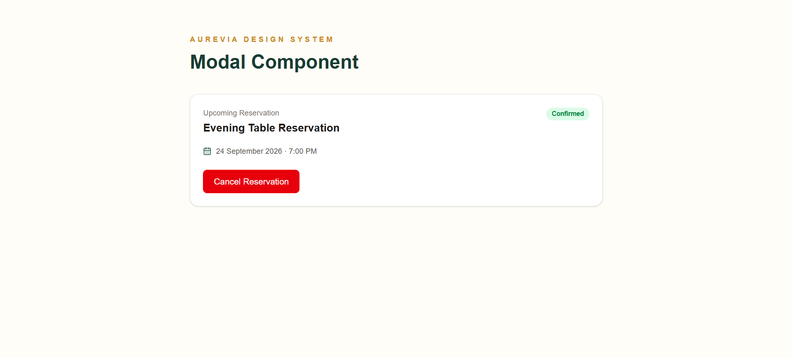
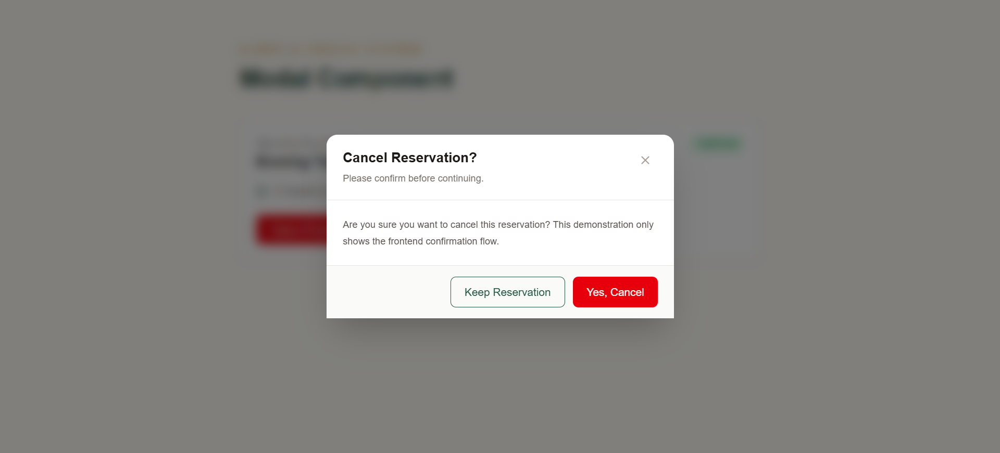

# AUREVIA

### Restaurant & Event Management System

AUREVIA is a modern web-based Restaurant and Event Management System designed to bring restaurant operations, event coordination, customer services, payments, inventory management, and staff management into one integrated platform.

The project is being developed following the Software Development Life Cycle (SDLC), with a focus on modular architecture, maintainability, responsive UI design, and practical intelligent features.

---

## Project Overview

AUREVIA is designed to support both customers and restaurant management through six integrated functional areas:

1. **Table & Event Venue Reservation**
   - Table reservations
   - Event venue reservations
   - Availability checking
   - Reservation status management
   - Dynamic venue pricing support

2. **Menu Customization & Food Recommendation**
   - Menu browsing and management
   - Catering menu customization
   - Dietary and allergen preferences
   - Food recommendations

3. **Event Coordination & Customer Feedback**
   - Event management
   - Event timelines
   - Vendor coordination
   - Customer feedback
   - Sentiment analysis support

4. **Billing & Payment Management**
   - Invoice management
   - Bank payment-slip upload
   - Manual cashier verification
   - Payment approval/rejection
   - Payment status tracking

5. **Smart Inventory & Food Waste Management**
   - Inventory management
   - Stock tracking
   - Low-stock alerts
   - Food waste records
   - Reorder recommendation support

6. **Staff Management & Predictive Staff Allocation**
   - Staff management
   - Shift scheduling
   - Staff assignments
   - Attendance and performance
   - Demand-based staff allocation support

---

## Technology Stack

### Frontend

- React
- Vite
- JavaScript
- Tailwind CSS
- React Router
- Axios
- Lucide React

### Planned Backend

- Java
- Spring Boot
- Spring Web
- Spring Data JPA
- Spring Security
- JWT Authentication
- Maven

### Database

- MySQL

### Development & Version Control

- Visual Studio Code
- IntelliJ IDEA
- MySQL Workbench
- Postman
- Git
- GitHub

---

## Frontend Design System

The AUREVIA frontend uses a reusable component-based design system.

The visual identity currently uses:

- Warm ivory backgrounds
- Deep emerald primary colors
- Gold accent colors
- Neutral stone text and surfaces
- Green success states
- Amber warning states
- Red error/danger states

The interface is designed to provide a modern and premium restaurant and event-management experience while remaining responsive and easy to use.

---

## Frontend Progress

### Foundation

- [x] React + Vite project setup
- [x] Tailwind CSS configuration
- [x] AUREVIA color theme
- [x] Responsive styling foundation
- [x] Lucide icon integration
- [x] Axios installed for future API integration
- [x] React Router installed for application routing

### Reusable Form Components

- [x] Button
- [x] Input Field
- [x] Select Field
- [x] Text Area Field
- [x] File Upload
- [x] Checkbox

### Reusable UI Components

- [x] Card
- [x] Status Badge
- [x] Modal
- [ ] Data Table
- [ ] Alert
- [ ] Tabs
- [ ] Loading State
- [ ] Empty State

### Application Interfaces

- [ ] Public website
- [ ] Authentication interfaces
- [ ] Customer dashboard
- [ ] Reservation management
- [ ] Menu & recommendation management
- [ ] Event coordination
- [ ] Billing & payment verification
- [ ] Inventory & waste management
- [ ] Staff management
- [ ] Administration interfaces

### Backend Integration

- [ ] REST API integration
- [ ] Authentication & authorization
- [ ] MySQL persistence
- [ ] File upload integration
- [ ] Role-based access control

---

## Current UI Preview

### Form Components

Reusable form controls have been created for data entry, reservation preferences, and future payment-slip uploads.



### Cards & Status Badges

Reusable cards and status indicators provide consistent presentation across reservations, payments, events, inventory, and staff interfaces.



### Modal Component

A reusable modal component has been implemented for confirmation and management workflows.



### Confirmation Modal

Example frontend reservation-cancellation confirmation flow:



> The current screenshots demonstrate frontend UI components using local demonstration data. Backend operations and database persistence will be integrated in later development stages.

---

## Payment Workflow

AUREVIA uses a manual bank-transfer verification process rather than a direct online payment gateway.

```text
Customer Reservation
        ↓
Invoice Generated
        ↓
Customer Uploads Bank Payment Slip
        ↓
Cashier Reviews Payment Slip
        ↓
Approve / Reject
        ↓
Payment Status Updated
        ↓
Reservation Confirmation
```

The frontend file-upload component is currently implemented. Server-side file storage, payment records, cashier verification, and database persistence will be implemented during backend integration.

---

## Planned Application Structure

```text
src/
├── assets/
│   ├── images/
│   └── icons/
├── components/
│   ├── common/
│   ├── dashboard/
│   ├── forms/
│   └── ui/
├── context/
├── data/
├── hooks/
├── layouts/
├── pages/
│   ├── public/
│   ├── auth/
│   ├── customer/
│   ├── reservation/
│   ├── menu/
│   ├── events/
│   ├── billing/
│   ├── inventory/
│   ├── staff/
│   ├── admin/
│   ├── dashboard/
│   └── errors/
├── routes/
├── services/
├── utils/
├── App.jsx
├── index.css
└── main.jsx
```

---

## Development Approach

AUREVIA is being developed incrementally.

```text
Requirements
     ↓
System Design
     ↓
Frontend Development
     ↓
Backend Development
     ↓
Database Integration
     ↓
Frontend–Backend Integration
     ↓
Testing
     ↓
Deployment
```

Reusable components are developed before complete application pages to maintain consistency and reduce duplicated code.

---

## Intelligent Features

The architecture is intended to support intelligent features including:

- Food recommendations
- Dynamic venue pricing
- Customer feedback sentiment analysis
- Inventory reorder recommendations
- Demand-based staff allocation

Initial implementations may use transparent rule-based approaches, with the architecture kept modular for future machine-learning or external-service integration.

---

## Project Status

**Current Phase:** Frontend Development

The reusable frontend design system is currently under development. Complete application pages and role-specific dashboards will be developed next, followed by backend and database integration.

---

## Repository

This repository contains the ongoing development of the AUREVIA Restaurant & Event Management System.

Development progress is documented through incremental Git commits as features are designed, implemented, tested, and integrated.